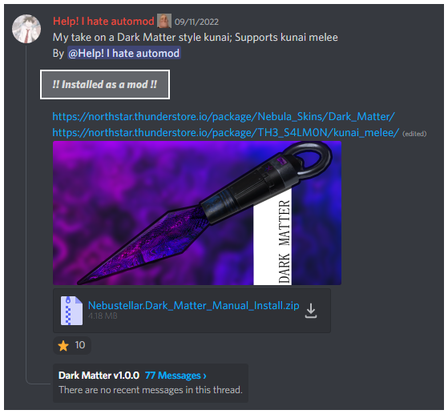
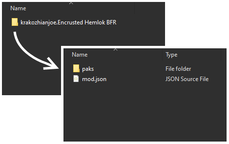
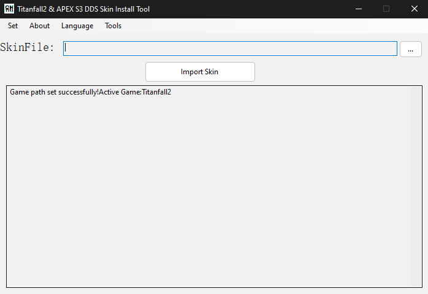

# yuh

## The Context

### **IF YOU DONT READ THIS, I'll kill BT third time.**

You're here because you want to use custom skins and have no idea what you're talking about. We don't want to waste our time and your time.&#x20;

**Pay attention.** **You're going to have to tell us exactly which method you're attempting** to install. Use this wiki page to compare and find out which method you're using.

### There is 3 types of custom skinning methods.

The hyperlinks link to how to install each type.

*   ****[**DDS (rpak method)**](https://media.discordapp.net/attachments/1002068248151470120/1019786338804973661/propermodinstallation.gif)****

    **Installed just like Northstar mods.** This is the best overall method.&#x20;
*   ****[**DDS (skintool method)**](https://retryy.gitbook.io/tf2/Guide/Install/dds)****

    **Installed with skintools.** This is bad. Stop using this.&#x20;
*   ****[**VTF (vpk method)**](https://retryy.gitbook.io/tf2/Guide/Install/vtf-manual-modding)****

    **Installed manually or as mod.** These are the animated and moving skins.&#x20;

## The Comparison

Time to compare these common traits, so you can identify the type of skin you're trying to use.

### DDS (rpak method)

You'll usually get these from the #skin-collection Discord channel or on [Thunderstore](https://northstar.thunderstore.io/).

This is the best overall method, most supported, recommended, and installed just like any other Northstar mod.&#x20;


The tool used to make these goes by RePak, but you never actually use it.


### Checking for DDS (rpak method)

#### Check the mod advertisement.

A good modder will have context on their mod download/advertisement. Check for "installed as a mod", "mod", "thunderstore mod".&#x20;

<figure><figcaption>
Custom skin with proper installation label. 
</figcaption></figure>

#### **Installed like any other Northstar mod.**&#x20;

They should appear like the common Northstar mod.&#x20;

* author.modSkinName
  * paks, mods, or vpk folder inside
  * mod.json

Example:

<figure><figcaption>
Average rpak skin Northstar mod.
</figcaption></figure>

#### Should appear in 'mods' list inside Northstar.

They should appear like the common Northstar mod.&#x20;

* author.modSkinName

<figure><figcaption></figcaption></figure>

#### If you still need more clarification.

* Reread the wiki page (It took me 1 hour to create and organize this one section).&#x20;
* Then think about for 30 seconds.
* Then ask us clarifying questions.

### DDS (skintool method)

**Installed with a "skintool".**

### Checking for DDS (skintool method)

#### SkinTool

The "skintool"s we are talking about are

* Strykus's Fork skintool: [https://github.com/Strykus/Titanfall2-SkinTool](https://github.com/Strykus/Titanfall2-SkinTool)
* zxcPandoras skintool: [https://github.com/zxcPandora/Titanfall2-SkinTool](https://github.com/zxcPandora/Titanfall2-SkinTool)

Images of skintools UI (there is no visual between the two)

#### Skin

You usually download a zip from #skin-collection in Discord

and they have 4096, 2048, 1024, 512 folders inside.&#x20;

This is the worst skin method.&#x20;

Use[ Advocate ](https://retryy.gitbook.io/tf2/Wiki/Tools/skin-tools#advocate-skintool-to-rpak-mod-converter)to convert 'DDS (skintool method)' to 'DDS (rpak method)'. Will improve quality.

### VTF (vpk method)

**Installed manually with a hex editor and vpks.**

Send us screenshots. I have no idea how to identify this method simply. You are probably just no idea what's going on and how to actually get skins in the game properly.

OR

You might just be using a skin that using vtfs to make it cooler. These just install like a normal Northstar mod. They should basically be 'DDS (rpak method)' mixed with 'VTF (vpk method)'.&#x20;

They should just look like

<figure><figcaption></figcaption></figure>

but with additional folders. Just install them any other mod.
