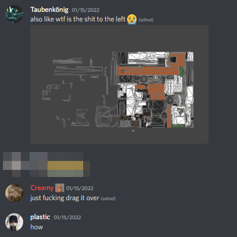
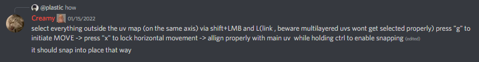

# Adjusting left uv's.

From the pins in #skins-chat in the Northstar Discord by Creamy. This is the archive of the pseudo guide. Discord Message Link at the bottom of the page.

## Content:

### Discord Message Links:

[https://discord.com/channels/920776187884732556/928271573977296957/932034576216375317](https://discord.com/channels/920776187884732556/928271573977296957/932034576216375317)

[https://discord.com/channels/920776187884732556/928271573977296957/932034985244885003](https://discord.com/channels/920776187884732556/928271573977296957/932034985244885003)
