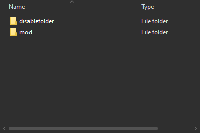

# Uninstalling

## Skin tool installed skins

### Installing default skins

You can install the default skins to essentially reset your skins.&#x20;

Navigate to [Titanfall-2-Modding](https://github.com/BigSpice/TitanFall-2-Skin-Modding/tree/main/Textures/Compiled%20textures) Github folder and download the requested skins you want to reset.&#x20;

Then just install the default skin as any other skin.

### Replacing pc\_stream.starpak

If you created a backup of `pc_stream.starpak` before installing skins. You can just replace `pc_stream.starpak` in `/Titanfall2/r2/paks/Win64/` .

## Northstar Mod skins

### VTOL Mod disable

If you use or want to use VTOL Northstar Manager. You can simply navigate to the "Mods" tab and disable the mod. (not detailed due to ui rework soon)

### Disrupt mod.json

We can disrupt the `mod.json` file that tells Northstar how to recognize the mod. This is really simple. This is actually how VTOL disables mods.

Go to your `mods` folder found at `/Titanfall2/R2Northstar/` and find the mod you want to disable. Open the mod folder that would look like something like:

Now simply put the `mod.json` file in it's own folder. The mod should now be disabled.

## Manual VTF skins

If you're doing this, why? Anyways, just replace the model you edited. Should repath correctly again.
