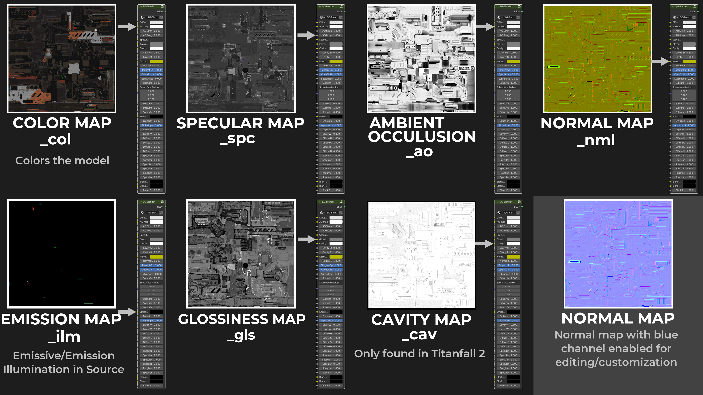

# Texture Maps

## New/Corrected Texture Map:

## Color Map:

Common names: Color, Base, col, or Diffuse. \
Titanfall 2 name: "col" or color map.

This map is for defining color.

## Glossiness:

Common names: Glossiness, Gloss, gls.\
Titanfall 2 name: "gls" or gloss map.

This map defines concentrated 'shine' or light scattering.

## Specular:

Common names: Specular, spec, or spc.\
Titanfall 2 name: "spc" or specular.

This map defines your metallic-ness.

## Roughness:

Common names: Roughness.\
Titanfall 2 name: or roughness map.

Some weapons use roughness over a glossiness map. Roughness maps use a combination of diffuse and specular reflectivity. Glossiness and Roughness are similar but not the same.

## Ambient Occlusion:

Common names: Ambient Occlusions, ao.\
Titanfall 2 name: "ao" or ambient occlusion.

Ambient occlusion reduce amount of light reflected back. Acting like a kind of shadow map.

## Normal:

Common names: Normal, nml.\
Titanfall 2 name: "nml" or normal.

The normal map is designed to give the rendering engine a map to show the depth of a model without needing real 3D depth to reflect the direction of light.

Normal maps disable there blue channel in order to save resources when in use. To view the channel in it's editable and desired condition you have to enable its blue channel.&#x20;

.png)

## Illumination(Emission):

Common names: Emission, Light, ilm, or Illumination.\
Titanfall 2 name: "ilm" or Illumination.

This map tells which parts are supposed to glow or emit light or glow. This doesn't affect the colour underneath.

## Cavity:

Common names: cavity, cav.\
Titanfall 2 name: "cav" or cavity.

Cavity maps is for the smallest and tightest crevasses but acts like Ambient Occlusion maps. We've only seen Titanfall 2 use this map.

### Height:

Common names: height.\
Titanfall 2 names: n/a.

Titanfall 2 doesn't have or use height maps. Although when making skins this is important to correctly display normal map information. It's a black an white map.&#x20;

"If you want a part of the gun to protrude more outwards it should be brighter then 0.5 luminance or if u want something to dent in it should be darker then 0.5 luminance. 0.5 is the base value and luminance is a pixels brightness."
